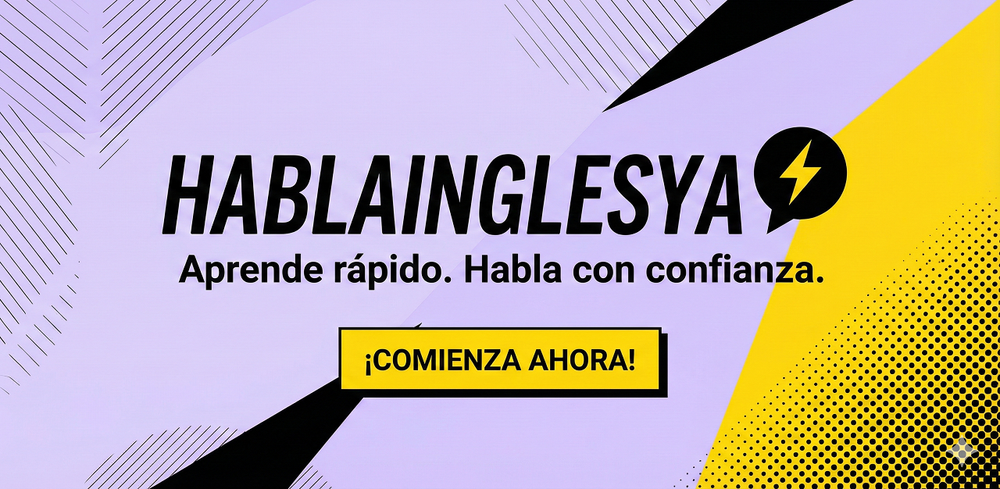

# HABLAINGLESYA 101

## Learn English from zero to hero

Useful external websites and tools

## Image editor and compressor

[website](https://squoosh.app/)

## Stripe docs

[website](docs.stripe.com/testing)

## Unit converter website

[website](https://unitconverters.net)

## React color

**A collection of color pickers from sketch, photoshop, chrome, github, twitter, material desing && more.**

[website](https://casesandberg.github.io/react-color/)

## .env validator

[website](https://env.t3.gg/docs/nextjs)

### Expose local services over TLS online (and a pastebin) - testing purposes

[http server to a tunnel](https://docs.srv.us/)

### Google OAuth2.0

[docs](https://developers.google.com/identity/protocols/oauth2)

## Markdown Linter

[website](https://dlaa.me/markdownlint/)

---

### Utility types in Typescript

### Test on chrome the mobile dev responsive using measure 350x660

#### Visit our website scanning this QR code

